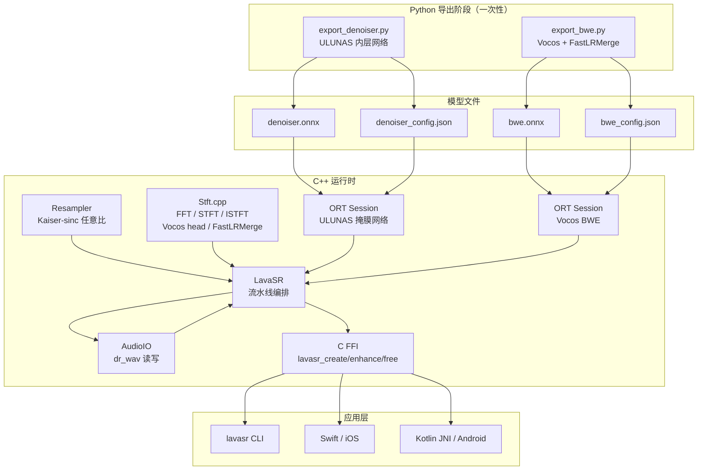

# LavaSR C++ 跨平台框架技术文档

本文档记录将 LavaSR 从纯 Python/PyTorch 实现迁移为 C++ 跨平台推理引擎的完整改造过程，涵盖技术决策、各模块设计原理与实际工作流程。

---

## 一、改造背景与目标

### 原始状态

LavaSR 的 Python 实现直接依赖：
- `torch` / `torchaudio`：模型推理与重采样
- `librosa`：音频文件读取
- `soundfile`：音频文件写入
- `huggingface_hub`：模型权重自动下载
- `vocos`：BWE 神经网络框架

这些依赖无法在嵌入式设备、移动端或无 Python 环境中运行。

### 改造目标

| 指标 | 要求 |
|------|------|
| 目标平台 | ARM Linux（aarch64）、Windows（x64/ARM64）、iOS（arm64）、Android（arm64-v8a） |
| 外部依赖 | 尽量为零，或全部 CMake FetchContent 自动拉取 |
| 接口 | C++17 class API + 纯 C FFI（供 Swift / Kotlin JNI / Python ctypes 调用） |
| 音质等价 | C++ 输出与 Python 参考实现频谱级一致 |

---

## 二、技术选型决策

### 推理后端：ONNX Runtime

| 候选 | 最终选择原因 |
|------|-------------|
| LibTorch | 二进制体积大（>100 MB），ARM 支持配置复杂 |
| TFLite | 不支持 GRU / 复杂卷积，opset 受限 |
| NCNN | 需重写模型权重转换脚本，维护成本高 |
| **ONNX Runtime** | 官方提供全平台预编译包；opset 17 支持 DFT（RFFT 算子）；C API 稳定 |

### FFT 实现：自包含 radix-2 + ONNX 内置算子

- BWE 模型的 `FastLRMerge`（RFFT/IRFFT）**包含在 ONNX 图内**，由 ONNX Runtime 执行（opset 17 DFT 算子）。
- 去噪器 ULUNAS 的 STFT / ISTFT 因 `torch.istft` ONNX 导出兼容性问题，在 **C++ 侧自行实现**（自包含 radix-2 Cooley-Tukey FFT，约 80 行，无外部依赖）。

---

## 三、整体架构



---

## 四、改造过程详述

### 阶段 1：ONNX 模型导出

#### 4.1 BWE 导出（`cpp/export/export_bwe.py`）

**核心挑战**：原始 `FastLRMerge` 使用 Python int 做下标（`mask[:cutoff_bin]`），ONNX tracing 会将其固化为常数，导致动态长度失效。

**解决方案**：重写为纯 element-wise 算子（`arange` + 算术运算），不含整数索引：

```python
bins = torch.arange(n_bins, dtype=torch.float32, device=pred.device)
cutoff_bin = self.cutoff_fraction * float(n_bins)   # 标量乘法，ONNX 追踪安全
t = (bins - cutoff_bin) / self.half_tw              # 线性归一化
t_c = t.clamp(-1.0, 1.0)
t01 = (t_c + 1.0) * 0.5
mask_real = 3.0 * t01 ** 2 - 2.0 * t01 ** 3       # smoothstep，纯算术
```

**两级降级策略**：

```
Mode A (full)  → ONNX 图含 ISTFT + FastLRMerge（首选）
      ↓ 失败时自动切换
Mode B (split) → ONNX 图仅含 feature_extractor + backbone + head.out
                 C++ 负责 ISTFT 与 FastLRMerge
```

脚本同时写出 `bwe_config.json` 记录模式与 ISTFT 参数，C++ 运行时按此选择执行路径。

#### 4.2 去噪器导出（`cpp/export/export_denoiser.py`）

**核心挑战**：ULUNAS 的 `torch.istft` 在部分 PyTorch 版本下无法正确导出 ONNX。

**解决方案**：抽离 `ULUNASInner`，将 STFT / ISTFT 移出 ONNX 图：

```python
class ULUNASInner(nn.Module):
    # 输入: stft_2ch (1, 2, T_frames, 257) ← C++ 提供
    # 输出: stft_enh  (1, 2, T_frames, 257) → C++ 做 ISTFT
    def forward(self, spec):
        feat = torch.log10(torch.norm(spec, dim=1, keepdim=True).clamp(1e-12))
        feat = self.erb.bm(feat)          # ERB 压缩（固定权重线性层）
        feat, en_outs = self.encoder(feat)
        feat = self.dpgrnn(feat)
        m_feat = self.decoder(feat, en_outs)
        m = self.erb.bs(m_feat)           # ERB 逆变换 + sigmoid 掩膜
        return spec * m
```

ONNX 图中包含 ERB（固定权重 Linear）、XConv/XMB 卷积块、GRU，全部为标准 opset17 算子。

---

### 阶段 2：C++ 核心库实现

#### 文件对应关系

| Python 原件 | C++ 对应 | 实现策略 |
|-------------|----------|---------|
| `librosa.load` + `torchaudio.resample` | `AudioIO.cpp` + `Resampler.cpp` | dr_wav 读写 + Kaiser sinc 重采样 |
| `torch.stft` / `torch.istft` | `Stft.cpp::stft` / `istft` | 自包含 radix-2 FFT |
| `LavaEnhance._enhance_mono` | `LavaSR.cpp::LavaSRImpl::process_mono` | ONNX Runtime 推理 |
| `FastLRMerge.__call__` | `Stft.cpp::fast_lr_merge` | 自包含 FFT（split 模式下） |
| `LavaBWE.infer` / `LavaDenoiser.infer` | `LavaSRImpl::run_bwe` / `run_denoiser` | ORT Session.Run |

---

## 五、各模块工作原理

### 5.1 AudioIO（`src/AudioIO.cpp`）

使用 `dr_wav`（单头文件，MIT 许可）：

- **读取**：`drwav_read_pcm_frames_f32` → `AudioData.samples`（interleaved float32）
- **写入**：`IEEE_FLOAT 32-bit` 格式，确保精度无损
- 立体声以 **帧交织** 方式存储：`[L0 R0 L1 R1 ...]`

```
WAV 文件
   │
   ▼  dr_wav
AudioData { samples[], sample_rate, n_channels, n_frames }
```

### 5.2 Resampler（`src/Resampler.cpp`）

实现 **Kaiser 窗 sinc 插值**，支持任意整数 `in_sr → out_sr` 比值：

```
步骤：
1. 计算 up/down 因子（约分 GCD）
2. 截止频率参数 W = 1/max(up,down)，对应通带边缘 W/2 = min(in_sr,out_sr)/2
3. 构造 Kaiser 窗 sinc FIR：h[n] = W·sinc(W·n)·kaiser(n)（DC gain = 1）
4. 多相滤波：output[i] 从输入位置 j = i·down/up 插值；结果乘以 up 补偿零插值能量
```

> **⚠ 滤波器公式的两个历史 Bug（均已修复）**
>
> | 缺陷 | 错误代码 | 正确代码 | 症状 |
> |------|---------|---------|------|
> | 截止频率多除 2 | `cutoff = 1.0/(2*max(up,down))` | `cutoff = 1.0/max(up,down)` | 16→48kHz 时通带仅到 4kHz，高频全黑 |
> | DC gain = 2 | `h[i] = sinc(W*n)*kaiser*2*W` | `h[i] = sinc(W*n)*kaiser*W` | 输出幅值翻倍，波形削顶 |
>
> 理想低通公式为 `h[n] = W·sinc(W·n)`，此时 `sum(h)=1`（DC gain=1）。多写一个 `2×` 使 `sum(h)=2`，经多相 `×up` 后每次重采样幅值翻倍。

关键比率：

| 场景 | 比率 | 说明 |
|------|------|------|
| 任意输入 → 16 kHz | 降采样 | 去噪器工作频率 |
| 16 kHz → 48 kHz | 精确 3× 上采样 | BWE 工作频率 |

### 5.3 Stft（`src/Stft.cpp`）

包含四个功能：

#### (a) radix-2 Cooley-Tukey FFT

```
原理：蝶形运算 + 位反转置换
复杂度：O(n log n)，n 须为 2 的幂
精度：内部使用 double 旋转因子，结果存为 float
```

```
fft_inplace(data, n, inverse=false)  → 正变换
fft_inplace(data, n, inverse=true)   → 逆变换（含 1/n 归一化）
```

#### (b) STFT（用于去噪器预处理）

```
参数（固定，与 ULUNAS 配套）：
  n_fft=512, hop_len=256, win_len=512, Hann 窗, onesided

流程：
  input[T] → 中心填充（两侧各 n_fft/2 个零） → 按 hop_len 取帧
           → 加 Hann 窗 → FFT → 取前 n_bins=257 个 bin
           → spec_real[n_frames × 257], spec_imag[n_frames × 257]
```

#### (c) ISTFT（用于去噪器后处理）

```
流程：
  spec_real + spec_imag → 补全 Hermitian 共轭 → IFFT
  → 加 Hann 窗 → 加权重叠相加（OLA）→ 归一化窗包络
  → 裁去中心填充 → 还原原始长度
```

#### (d) Vocos head（BWE split 模式下）

对应 Python 中的 `custom_forward`：

```
raw_head_out (1, n_fft+2, T_frames)
  ↓ 分为 mag_part, phase_part（各 n_fft/2+1 个通道）
  ↓ mag = exp(mag_part).clip(0, 1e3)
  ↓ S_real = mag * cos(phase_part)
  ↓ S_imag = mag * sin(phase_part)
  ↓ ISTFT(S_real + j·S_imag)
  → pred_wav[T]
```

#### (e) FastLRMerge（BWE split 模式后处理）

```
输入：pred_wav（BWE 预测），orig_wav（48k 上采样原始）
  ↓ 分别做 RFFT（零填充到 2 的幂）
  ↓ 逐 bin 计算 smoothstep mask：
      bins ∈ [0, N/2]，以 cutoff_bin 为中心，trans_bins 宽过渡带
      mask = smoothstep(3t²-2t³)，0=保留原始，1=保留预测
  ↓ merged_spec = orig_spec + (pred_spec - orig_spec) × mask
  ↓ IRFFT → merged_wav[T]
```

**效果**：低频（<cutoff_hz）保留原始波形，高频由网络补全，transition 带用 smoothstep 平滑衔接，消除 8 kHz 附近的频谱凹陷（"黑道"）。

### 5.4 推理流水线（`src/LavaSR.cpp`）

每个声道独立执行 `process_mono`：

```
输入：单声道 float32 @ in_sr
  │
  ▼ Resampler (any → 16 kHz)
  │
  ├─[denoise=true]─▶ STFT(n_fft=512) ─▶ ORT(ULUNASInner) ─▶ ISTFT ─┐
  └─[denoise=false]──────────────────────────────────────────────────┘
  │
  ▼ Resampler (16 kHz → 48 kHz)
  │
  ▼ ORT(Vocos BWE)
  │
  ├─[mode=full]──▶ 直接输出 48 kHz（FastLRMerge 已含在 ONNX 图中）
  └─[mode=split]─▶ vocos_head_and_istft ─▶ fast_lr_merge ─▶ 输出
  │
  ▼ float32 @ 48 kHz
```

**立体声处理**：左右声道分别走上述流程，最后 interleave 合并：

```cpp
auto out_l = process_mono(left.data(),  n_frames, in_sr, denoise);
auto out_r = process_mono(right.data(), n_frames, in_sr, denoise);
// 合并: [L0 R0 L1 R1 ...]
```

### 5.5 ONNX Runtime 会话管理

```
LavaSRImpl::load()
  ├── 读取 bwe_config.json   → 确定 mode/n_fft/hop/cutoff 等
  ├── 读取 denoiser_config.json → 确定 STFT 参数
  ├── Ort::Session(bwe.onnx)
  └── Ort::Session(denoiser.onnx)

ort_run_1in_1out()
  ├── CreateTensor<float>(input)
  ├── session.Run(…)
  └── 返回 std::vector<float>(output)
```

Windows 路径使用 `std::wstring` 转换，其余平台直接用 `char*`，通过 `#ifdef _WIN32` 区分。

---

## 六、公共 API 设计

### C++ API

```cpp
namespace lavasr {
    struct LavaSRConfig {
        int  cutoff_hz  = 7500;   // FastLRMerge 分频点（Hz）
        bool denoise    = false;  // 开启 ULUNAS 去噪
        bool batch_mode = false;  // 超长音频分块
    };

    class LavaSR {
    public:
        LavaSR(const std::string& bwe_onnx,
               const std::string& denoiser_onnx,
               const LavaSRConfig& config = {});

        // 输入：interleaved float32 @ in_sr Hz
        // 输出：interleaved float32 @ 48 kHz
        std::vector<float> enhance(const float* samples, int n_frames,
                                   int in_sr, int n_channels);
    };
}
```

### C FFI（供 Swift / Kotlin JNI / Python ctypes）

```c
// 创建实例
LavaSRHandle h = lavasr_create("bwe.onnx", "denoiser.onnx",
                               /*cutoff_hz*/ 7500,
                               /*denoise*/   0);

// 推理（堆分配 buffer，调用方负责释放）
float* out; int out_frames;
lavasr_enhance(h, pcm, n_frames, 16000, 2, 0, &out, &out_frames);
// 使用 out[0 .. out_frames*2]
lavasr_free_buffer(out);

// 销毁
lavasr_free(h);
```

---

## 七、CMake 构建系统

### 依赖获取（全自动）

```cmake
# ONNX Runtime：按平台选择预编译包 URL
FetchContent_Declare(onnxruntime_pkg URL "${ORT_URL}")

# dr_wav：单头文件 WAV I/O
FetchContent_Declare(dr_libs GIT_REPOSITORY https://github.com/mackron/dr_libs.git)

# nlohmann/json：单头文件 JSON 解析
FetchContent_Declare(nlohmann_json URL "...json.hpp")
```

### 平台矩阵

| 平台 | CMake 生成器 / 工具链 | ORT 包名 |
|------|----------------------|----------|
| Windows x64 | `Visual Studio 17` `-A x64` | `onnxruntime-win-x64-1.20.1.zip` |
| Windows ARM64 | `Visual Studio 17` `-A ARM64` | `onnxruntime-win-arm64-1.20.1.zip` |
| Linux x64 | 系统 GCC/Clang | `onnxruntime-linux-x64-1.20.1.tgz` |
| Linux aarch64 | `toolchains/linux_aarch64.cmake` | `onnxruntime-linux-aarch64-1.20.1.tgz` |
| Android arm64 | NDK toolchain | `onnxruntime-android-1.20.1.aar` |
| iOS arm64 | `toolchains/ios.cmake` + Xcode | `onnxruntime-ios-xcframework-1.20.1.zip` |

### 编译选项

| 选项 | 默认 | 说明 |
|------|------|------|
| `BUILD_CLI` | `ON` | 编译 `lavasr` 命令行工具 |
| `BUILD_SHARED_LIB` | `OFF` | 构建动态库（`.dll/.so`）而非静态库 |
| `ORT_VERSION` | `1.20.1` | ONNX Runtime 版本 |

---

## 八、关键设计决策汇总

| 问题 | 决策 | 理由 |
|------|------|------|
| FastLRMerge ONNX 导出 | 重写为纯 element-wise 算子 | 原始 Python int 索引会被 tracing 固化 |
| ULUNAS STFT/ISTFT | 移出 ONNX，C++ 自实现 | `torch.istft` ONNX 兼容性不稳定 |
| BWE 导出策略 | Mode A/B 双模式 + 自动降级 | 不同 PyTorch 版本行为有差异 |
| FFT 实现 | 自包含 radix-2（~80 行） | 零依赖；ULUNAS n_fft=512 = 2⁹ 完美匹配 |
| 重采样 | Kaiser sinc | 任意比率，ARM NEON 友好 |
| 音频 I/O | dr_wav 单头文件 | 无依赖，MIT，支持 PCM/Float32 |
| JSON 配置 | nlohmann/json 单头文件 | 解析 bwe_config / denoiser_config |
| C FFI 内存 | `new[]` / `delete[]` | 与 `lavasr_free_buffer` 配对，明确所有权 |
| 立体声 | 各声道独立 + 最后交织 | 去噪/BWE 网络均为单声道 |

---

## 九、与 Python 版本的对应关系

| Python | C++ |
|--------|-----|
| `LavaSR/model.py :: _enhance_mono` | `LavaSR.cpp :: process_mono` |
| `LavaSR/enhancer/enhancer.py :: LavaBWE.infer` | `LavaSRImpl::run_bwe` |
| `LavaSR/denoiser/denoiser.py :: LavaDenoiser.infer` | `LavaSRImpl::run_denoiser` |
| `LavaSR/enhancer/linkwitz_merge.py :: FastLRMerge.__call__` | `Stft.cpp::fast_lr_merge` / ONNX 内 |
| `LavaSR/utils.py :: load_wav` | `AudioIO.cpp::load_wav` + `Resampler.cpp::resample` |
| `torch.stft` / `torch.istft` | `Stft.cpp::stft` / `istft` |
| `custom_forward` (Vocos head) | `Stft.cpp::vocos_head_and_istft` |
| `torchaudio.functional.resample(16k, 48k)` | `Resampler.cpp::resample(16000, 48000)` |

---

## 十、使用流程

### 一次性准备：导出 ONNX 模型

```bash
cd cpp/export
python export_bwe.py      <hf_snapshot_dir>                ./models
python export_denoiser.py <hf_snapshot_dir>/denoiser/denoiser.bin ./models/denoiser.onnx
```

### 编译

```bash
# Windows
cmake -B build -G "Visual Studio 17 2022" -A x64
cmake --build build --config Release

# Linux ARM64
cmake -B build -DCMAKE_TOOLCHAIN_FILE=cmake/toolchains/linux_aarch64.cmake
cmake --build build -j$(nproc)

# Android
cmake -B build -DCMAKE_TOOLCHAIN_FILE=cmake/toolchains/android.cmake -DBUILD_CLI=OFF
cmake --build build -j$(nproc)
```

### 运行

```bash
# CLI
./build/lavasr --bwe models/bwe.onnx --denoiser models/denoiser.onnx \
               --cutoff 7500 input.wav output.wav

# 带去噪
./build/lavasr --bwe models/bwe.onnx --denoiser models/denoiser.onnx \
               --cutoff 7500 --denoise input.wav output.wav
```

---

## 十一、文件清单

```
cpp/
├── CMakeLists.txt                     # 主构建文件
├── README.md                          # 使用说明
├── cmake/
│   ├── onnxruntime.cmake              # ORT 自动下载与导入
│   ├── platform_settings.cmake        # 编译标志、NEON/AVX2 适配
│   └── toolchains/
│       ├── linux_aarch64.cmake        # Linux ARM64 交叉编译
│       ├── ios.cmake                  # iOS Xcode 工具链
│       └── android.cmake              # Android NDK 工具链
├── export/
│   ├── export_bwe.py                  # 导出 BWE（Mode A/B 自动选择）
│   ├── export_denoiser.py             # 导出 ULUNASInner（split 模式）
│   └── README.md                      # 导出步骤说明
├── include/lavasr/
│   ├── LavaSR.h                       # 公共 C++ class + C FFI 声明
│   ├── AudioIO.h                      # WAV I/O 接口
│   ├── Resampler.h                    # 重采样接口
│   └── Stft.h                         # FFT/STFT/FastLRMerge 接口
├── src/
│   ├── LavaSR.cpp                     # 主流水线 + ONNX Runtime 调用
│   ├── AudioIO.cpp                    # dr_wav 实现
│   ├── Resampler.cpp                  # Kaiser sinc 重采样
│   └── Stft.cpp                       # FFT/STFT/ISTFT/FastLRMerge 实现
└── app/
    └── main.cpp                       # CLI 入口（argparse + 调用 LavaSR）
```
