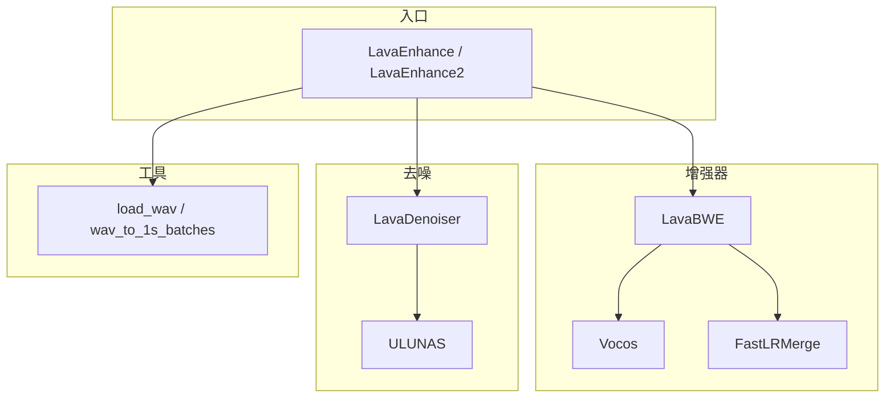
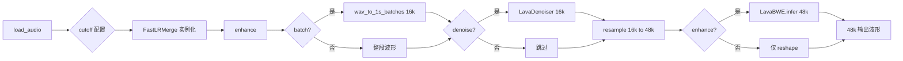

# LavaSR 项目架构指南

本文档面向需要在代码层面理解 LavaSR 的开发者，说明**模块划分、端到端数据流、采样率与张量约定**，以及 **BWE（带宽扩展）**、**Linkwitz-Riley 风格频域融合**、**UL-UNAS 去噪**三条主线在仓库中的落点。安装步骤与一行式用法见仓库根目录的 [README.md](README.md)。

---

## 1. 项目定位与设计目标

LavaSR 是一套**轻量级语音增强 / 带宽扩展（BWE）**方案：将较低采样率、可能含噪的语音，增强为更干净、带宽更宽的高质量波形。设计上强调：

- **单遍推理**：增强主干基于 [Vocos](https://github.com/gemelo-ai/vocos) 式结构（各向同性、非扩散），延迟与吞吐优于多步生成模型。
- **低显存占用**：官方 README 给出约 500MB 级 VRAM 量级（具体随实现与 batch 而变）。
- **宽输入采样率**：用户可在约 8–48 kHz 范围内指定输入采样率；**内部流水线**在去噪与上采样阶段有固定的 16 kHz / 48 kHz 工作点（见下文）。
- **可选去噪**：基于 **UL-UNAS** 思路的频域掩膜网络，仅在 `denoise=True` 时参与推理。

质量与速度对比数据以 [README.md](README.md) 中的表格为准，本文不重复罗列。

---

## 2. 仓库与包结构

```
LavaSR/
├── pyproject.toml          # 包元数据与声明依赖
├── README.md
├── 项目架构指南.md         # 本文档
└── LavaSR/
    ├── __init__.py
    ├── model.py            # LavaEnhance / LavaEnhance2 入口与端到端编排
    ├── utils.py            # 读盘、长音频分块
    ├── enhancer/
    │   ├── enhancer.py     # LavaBWE：Vocos 加载与推理
    │   └── linkwitz_merge.py  # FastLRMerge：频域融合后处理
    └── denoiser/
        ├── denoiser.py     # LavaDenoiser：权重加载封装
        └── ulunas.py       # ULUNAS 网络与 STFT 掩膜增强
```

### 2.1 权重与 Hugging Face 目录约定

本仓库**不包含**训练好的 `pytorch_model.bin`、`config.yaml`、`denoiser.bin` 等文件。默认 `model_path="YatharthS/LavaSR"` 时，[`model.py`](LavaSR/model.py) 通过 `huggingface_hub.snapshot_download` 拉取快照到本地目录，代码假定相对布局为：

| 组件 | 相对路径（在快照根目录下） |
|------|---------------------------|
| BWE v1 | `enhancer/pytorch_model.bin`、`enhancer/config.yaml` |
| BWE v2 | `enhancer_v2/` 同上 |
| 去噪器 | `denoiser/denoiser.bin` |

若自行指定本地 `model_path`，需保持上述子目录结构一致。

### 2.2 v1 与 v2 入口差异

- **`LavaEnhance`**：BWE 权重目录为 `{model_path}/enhancer`。
- **`LavaEnhance2`**：继承 `LavaEnhance` 的 `enhance` / `load_audio` 逻辑，仅在构造函数中将 BWE 目录换为 `{model_path}/enhancer_v2`；去噪器路径仍为 `{model_path}/denoiser/denoiser.bin`。

---

## 3. 子模块依赖关系



---

## 4. 端到端推理流水线

### 4.1 采样率契约（重要）

| 阶段 | 采样率 | 说明 |
|------|--------|------|
| 读入与去噪输入 | **16 kHz** | `load_wav` 最终将波形统一到 16 kHz；`enhance` 中去噪器在此采样率下工作。 |
| BWE 输入 | **48 kHz** | 去噪后或未去噪时，均通过 `torchaudio.functional.resample` 从 16 kHz 升到 48 kHz 再送入 `LavaBWE`。 |
| 输出 | **48 kHz** | BWE 输出为宽带波形，与 README 示例中 `sf.write(..., 48000)` 一致。 |

因此：**用户声明的 `input_sr` 主要影响读入时的中间重采样与 `cutoff` 默认值**；去噪与 BWE 之间的固定跳变由 [`model.py`](LavaSR/model.py) 写死为 16 kHz → 48 kHz。

### 4.2 主流程（Mermaid）



### 4.3 `load_audio` 与 `FastLRMerge`

每次调用 `load_audio` 时，若未显式传入 `cutoff`，则 `cutoff = input_sr // 2`（奈奎斯特的一半，与 README「约半采样率」一致），并**重新构造** `self.bwe_model.lr_refiner = FastLRMerge(..., cutoff=cutoff, transition_bins=1024)`。这样分频融合截止频率与声明的输入带宽一致；`transition_bins` 控制过渡带在 FFT bin 上的宽度。

### 4.4 `enhance` 参数语义

[`LavaEnhance.enhance(wav, enhance=True, denoise=True, batch=False)`](LavaSR/model.py)：

- **`denoise`**：为真时先走 `LavaDenoiser`，再 16→48 kHz；为假则直接对输入做 16→48 kHz（输入仍须与内部 16 kHz 约定一致）。
- **`enhance`**：为真时执行 `LavaBWE.infer`；为假则只返回上采样后的波形。
- **`batch`**：为真时用 `wav_to_1s_batches` 按约 1.28 s 分块（见第 7 节），适合极长音频；需注意与尾部填充策略的配合。

执行顺序固定为：**分块 → 去噪（可选）→ 重采样到 48 kHz → BWE（可选）**。

---

## 5. 增强器子系统：`LavaBWE`（Vocos + 后处理）

实现文件：[LavaSR/enhancer/enhancer.py](LavaSR/enhancer/enhancer.py)。

### 5.1 结构

1. 从 `{model_path}/config.yaml` 构建 `Vocos.from_hparams`，再加载 `pytorch_model.bin`。
2. 推理路径与 Vocos 一致：`feature_extractor` → `backbone` → `head`。
3. 对 `head.forward` 做 **monkey patch**，替换为同文件中的 `custom_forward`。

### 5.2 `custom_forward` 在做什么

补丁将 `head` 的输出解释为幅度与相位两支：对幅度分支做 `exp` 并 `clip` 上限，避免过大值；用 cos/sin 构造实部/虚部，形成复数谱后经 **ISTFT** 还原时域。与上游 Vocos 默认实现相比，该版本强调**数值稳定**与**对幅度动态范围的控制**（以代码行为为准，具体超参以权重训练目标为据）。

### 5.3 `FastLRMerge`：Linkwitz-Riley 启发的频域融合

实现文件：[LavaSR/enhancer/linkwitz_merge.py](LavaSR/enhancer/linkwitz_merge.py)。

在 `LavaBWE.infer` 末尾，对 **BWE 预测波形**与 **48 kHz 上采样后的输入波形**（长度对齐后）做 RFFT：

- 融合公式等价于 `spec_merged = spec_pred + (spec_input - spec_pred) * mask`（代码中为 in-place 累加形式）。
- **掩膜 `mask`**：在截止频率以下趋近 **0**，以上趋近 **1**，中间用 **smoothstep**（\(3t^2 - 2t^3\)）过渡，使低频更多保留**输入**、高频更多采用**模型预测**，减轻 BWE 常见的金属感与伪高频。
- `mask` 按 `(n_bins, ndim)` 缓存，避免重复分配；默认 `sample_rate=48000` 与 BWE 段一致。

`infer` 中在 `torch.autocast` 可能开启时，对 **ISTFT 后的 `FastLRMerge` 调用**使用 `autocast_func(enabled=False)` 并在 `.float()` 上运算，保证 FFT 与融合在 **FP32** 下完成，减少半精度频域误差。

### 5.4 可选混合精度

`LavaBWE.infer(wav, autocast=False)`：`autocast=True` 时在支持设备上对特征与主干使用 FP16/BF16  autocast；**融合步骤仍强制关闭 autocast**（见上文）。

---

## 6. 去噪子系统：`LavaDenoiser` 与 `ULUNAS`

### 6.1 封装

[LavaSR/denoiser/denoiser.py](LavaSR/denoiser/denoiser.py) 将 `denoiser.bin` 加载到 `ULUNAS` 实例，`infer` 内使用 `torch.inference_mode()`。

### 6.2 ULUNAS 数据流（科普级）

实现文件：[LavaSR/denoiser/ulunas.py](LavaSR/denoiser/ulunas.py)（文件头注明基于 Xiaobin-Rong 的实现与 MIT 许可）。

1. **STFT**：`n_fft=512`、`hop_length=256`，得到复数谱并拆成实部/虚部；取幅度经 `log10` 得对数幅度特征。
2. **ERB（等效矩形带宽）压缩**：将线性频轴上的高维 bins 压到 ERB 尺度上的较少维度，使人耳敏感频段信息更集中，便于小网络建模。
3. **Encoder**：由 `XConvBlock` / `XDWSBlock` / `XMBBlocks` 堆叠，带时间/频率步进与 **skip 连接**，供 Decoder 相加恢复分辨率。
4. **DPGRNN（双路径分组 RNN）**：在特征图上先做 **帧内（沿频率）** 双向建模，再做 **帧间（沿时间）** 因果建模，兼顾局部谱结构与时序连续性。
5. **Decoder**：输出与 STFT 维度对齐的 **掩膜**（经 sigmoid），在 ERB 逆变换后与原复数谱 **逐点相乘**，再 **ISTFT** 得到增强波形；尾部 pad 回原始样本长度。

**cTFA**（因果时频注意力）等模块在块内对通道与时间/频率进行门控，用于强调语音分量、抑制噪声模式。整体属于 **谱增强（masking）** 类语音增强，而非波形域扩散模型。

---

## 7. 工具函数与长音频

[LavaSR/utils.py](LavaSR/utils.py)

### 7.1 `load_wav`

- 使用 `librosa.load(..., sr=48000)` 读入（固定以 48 kHz 解码时长），再经 `torchaudio.functional.resample`：**先**重采样到 `resample_to`（通常即 `load_audio` 传入的 `input_sr`），**再**重采样到 **16000 Hz**，并 `unsqueeze(0)` 得到 `(1, T)`。
- 因此无论用户希望的「逻辑输入采样率」如何，**进入 `enhance` 的波形始终是 16 kHz**；`input_sr` 仍用于 `cutoff` 默认 `input_sr // 2`，与 README 中「任意 8–48 kHz」的语义一致。

### 7.2 `wav_to_1s_batches`

- 块长为 `1.28 * sr` 个样本（`batch=True` 时 `sr` 固定为 16000）。
- 若总长度非块长整数倍，用**重复原波形**的方式填充尾部，再 `view` 成 `(N, chunk)`，并返回 `pad_size` 供后续如需裁切时参考。

---

## 8. 依赖与运行环境

[pyproject.toml](pyproject.toml) 中声明的主要依赖：

- `torch`、`librosa`、`soundfile`
- `vocos`（Git：`https://github.com/langtech-bsc/vocos.git`，分支 `matcha`）

**实际运行时尚需、但未在 `dependencies` 中列出**的导入包括：

- `torchaudio`（重采样与 STFT 相关路径）
- `huggingface_hub`（默认 Hub ID 下载快照）
- `einops`（`ulunas.py` 中的 `rearrange`）

建议在独立环境中安装本包后，若遇 `ModuleNotFoundError`，按报错补装上述包；长期维护可考虑在 `pyproject.toml` 中显式加入这些依赖以免遗漏。

---

## 9. 关键源码索引

| 主题 | 文件 |
|------|------|
| 类入口与流水线顺序 | [LavaSR/model.py](LavaSR/model.py) |
| Vocos 推理与 `head` 补丁 | [LavaSR/enhancer/enhancer.py](LavaSR/enhancer/enhancer.py) |
| Linkwitz 风格频域融合 | [LavaSR/enhancer/linkwitz_merge.py](LavaSR/enhancer/linkwitz_merge.py) |
| 去噪封装 | [LavaSR/denoiser/denoiser.py](LavaSR/denoiser/denoiser.py) |
| ULUNAS 网络与 STFT 掩膜 | [LavaSR/denoiser/ulunas.py](LavaSR/denoiser/ulunas.py) |
| 分块与加载 | [LavaSR/utils.py](LavaSR/utils.py) |

---

## 10. 致谢与上游（与 README 对齐）

- **Vocos**：BWE 主干架构来源，见 README Acknowledgments。
- **UL-UNAS**：去噪网络设计与实现参考，仓库中 `ulunas.py` 保留原作者版权与 MIT 许可证声明。

模型与整体代码许可证以仓库 [LICENSE](LICENSE) 为准。
